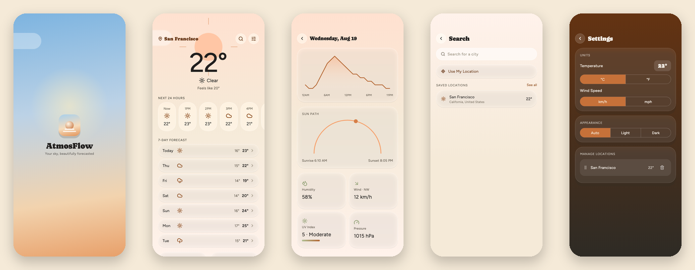
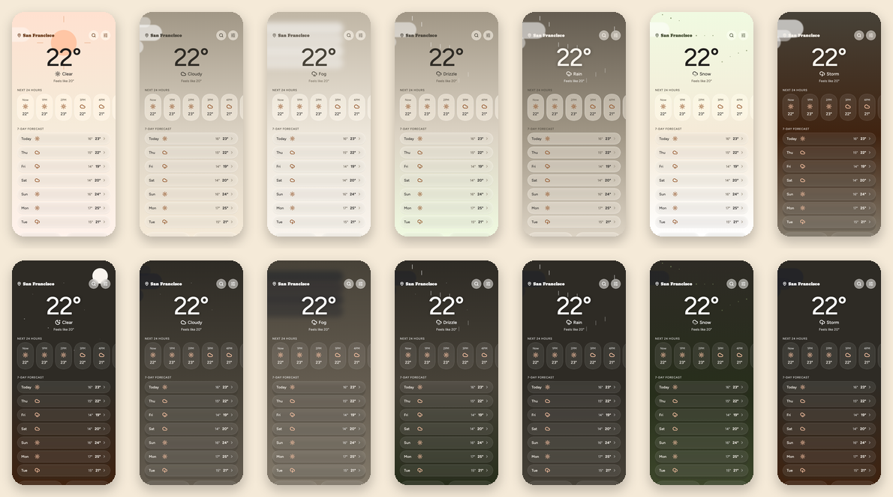
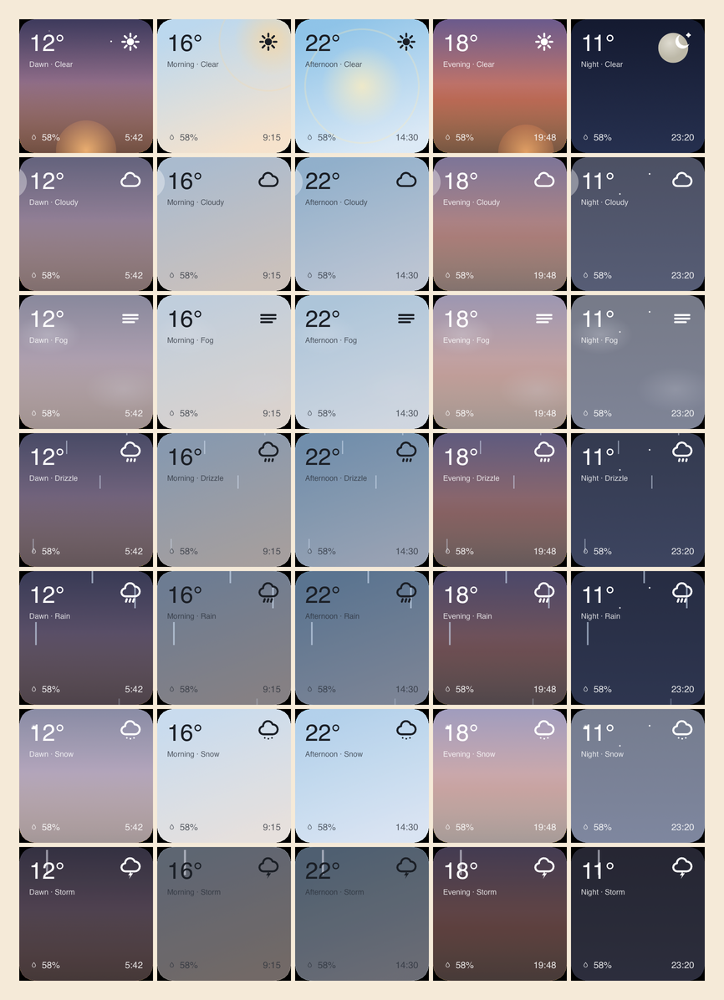

<div align="center">


**A weather app that shows you the sky before it shows you a number.**

[](https://flutter.dev)
[](https://dart.dev)
[](#home-screen-widgets)
[](https://open-meteo.com)
[](https://github.com/suraj-shetty/AtmosFlow/actions/workflows/ci.yml)
[](#testing)
[](LICENSE)

</div>

---

Designed and built by **Suraj Shetty**. The visual design is mine, made in
[Claude Designs](https://claude.ai/design/p/ac9e9aee-0640-47ce-8a80-5866410dc37a),
and the app is my Flutter implementation of it: seven screens over a live animated
sky, home-screen widgets on both platforms, and a launch sequence that treats the
splash as weather rather than as a wait.



## What it does

|  |  |
| --- | --- |
| **The whole screen is the sky** | Seven conditions, each with a day and a night treatment — drifting cloud blobs, falling rain and snow, a lightning bolt on a 3.2s cycle, a star field, a sun with a 120-second ray spin. |
| **Motion transcribed, not invented** | Every drop, band and blob keeps the duration and delay the design's CSS gave it — the storm's bolt and full-screen flash on their 3.2s cycle, snowflakes drifting 12px sideways as they fall, four fog bands at 22–30s. |
| **Reads the forecast, not a dashboard** | A 96px hero temperature, an hourly strip whose chips expand to their precipitation line, a seven-day list, and a metric grid that staggers in at 0/60/120/180ms. |
| **Widgets on both platforms** | 105 tiles — 7 conditions × 5 times of day × 3 layouts — generated from the design's CSS for WidgetKit and `RemoteViews` alike. |
| **Still when you ask it to be** | Reduce Motion holds every layer at its opening frame. It does not strip the sky out; less movement is not less weather. |

## The fourteen skies

Every condition, in daylight and after dark. These are the golden files — the
README cannot show the app looking like anything the tests disagree with.



## Home-screen widgets



Seven conditions down, five times of day across — dawn, morning, afternoon,
evening, night — resolved from the place's own sunrise and sunset rather than
from the clock.

The design writes those tiles as inline CSS. Hand-transcribing 35 layer sets
into Swift *and* Kotlin would be seventy chances to mistype an alpha, so the
CSS is parsed once into a typed model and both catalogues are generated from
it. Neither platform can animate a widget, so every keyframe is sampled at one
shared instant — 2.944s, chosen because it is 92% of the storm's flash cycle
and a widget that holds one picture for minutes should have its lightning in
it.

Full write-up, including the two places the platforms will not follow the
design: **[docs/home-screen-widgets.md](docs/home-screen-widgets.md)**

<br clear="right">

## The landing page

[`docs/index.html`](docs/index.html) is the design's own landing page,
built the same way everything else here is — the Organic tokens ported into the
stylesheet, the hero phone drawn from the design's markup and keyframes. It is
a single self-contained file — no build step, no scripts — and it is live at
**<https://suraj-shetty.github.io/AtmosFlow/>**, served from `main` → `/docs`.

It opens with a 25-second recording of three runs side by side: a clear night in
San Francisco, cloud over Tokyo, and a thunderstorm over Guangzhou, each captured
against live Open-Meteo data and lined up on the moment it launches. The conditions
are whatever the sky was doing that afternoon — nothing is seeded or staged.

## Quick start

```bash
flutter run
```

No API key, no signup, no `.env`. Generated code (freezed + json_serializable)
is committed, so a fresh clone compiles without a codegen step:

```bash
flutter analyze && flutter test
```

Regenerate after editing any model, and commit the result alongside the change:

```bash
dart run build_runner build --delete-conflicting-outputs
```

## Design → code

The app, the widgets and the brand all come from one design of mine, and each is
**generated from that design's own CSS** rather than transcribed by hand:

| | |
| --- | --- |
| [`tool/widget_spec/`](tool/widget_spec) | the widget design's CSS → `AmbientCatalog.swift` + `AmbientCatalog.kt` |
| [`tool/brand/`](tool/brand) | the mark → every app-icon size and launch asset on both platforms |
| `lib/core/theme/atmos_tokens.dart` | a typed port of the project's Organic design system — colours, ramps, spacing, radii, shadows |

Nothing outside `atmos_tokens.dart` hard-codes a hex or a px; widgets read
`context.tokens`. `weather_palette.dart` holds the per-condition skies,
transcribed from the prototype's `HOME_PALETTE` and `OB_MOODS`.

The brand generator is checked against the design by rendering both at 248px
and diffing: the output is pixel-identical.
**[docs/brand.md](docs/brand.md)** covers the icon's four size treatments and
the launch timeline.

## Data

[Open-Meteo](https://open-meteo.com) — free, no API key, no signup. Forecasts
from `api.open-meteo.com`, city search from `geocoding-api.open-meteo.com`,
reverse geocoding from the platform's own geocoder.

Everything is requested and stored in canonical units — °C, km/h, metres, hPa —
and converted for display at the edge by `UnitFormatter`. The user's °C/°F and
km/h/mph choices never reach the domain layer.

## How it is put together

Feature-first, four layers per feature:

```
lib/
  core/
    theme/          AtmosTokens (the Organic design system), palettes, glass, motion
    failure/        AppFailure — the closed set of things that go wrong
    persistence/    SharedPreferences wiring
    widgets/        Shared chrome: screen transitions, section labels, segments
  features/
    weather/
      domain/       Immutable models + the WeatherRepository interface
      data/         Open-Meteo client, the design's fixtures, WMO code mapping
      application/  Riverpod providers
      presentation/ Home, Day Detail, and the ambient sky layers
    home_widget/    The snapshot the OS widgets read, and the channel that publishes it
    splash/         The brand mark, and the gate that holds it over the router
    search/  settings/  onboarding/
  routing/          go_router, with Search and Settings presented modally
```

**State.** Riverpod 3, hand-written providers rather than codegen — the
`riverpod_generator` package requires Dart 3.9+ and this project's declared SDK
floor is 3.8.1. `forecastProvider` and `placeSearchProvider` opt out of
Riverpod 3's default retry-on-error: the design puts the user in charge with an
explicit "Try again" and pull-to-refresh.

**Animation.** Every duration and curve lives in `core/theme/motion.dart`,
transcribed from the design's CSS keyframes. The ambient sky repaints
independently of the content — Home feeds its scroll offset to `AmbientSky`
through a `ValueNotifier`, so parallax costs one repaint rather than a rebuild.
All of it honours `MediaQuery.disableAnimationsOf`, which is also how the
widget tests get a still frame to settle on.

**The launch.** The splash sits *over* the router rather than inside it as a
route: Home is built and laid out underneath while the splash is still on
screen, so the handoff is a cross-dissolve between two skies instead of a
screen swap. The OS launch image is rendered from the same description Flutter
draws from, and lands in the same place, so there is no seam between them.

## Testing

```bash
flutter test
```

156 passing, one skipped. Among them, 21 golden files: every screen once, Home
across all seven conditions in daylight and at night, and the splash in both
appearances.

CI runs the other 135 and leaves the goldens out — text rasterises differently
on a runner than on the machine that rendered the files, so all 21 fail there
while being perfectly correct. That is the same reason they are a record rather
than an oracle, so the exclusion costs nothing a runner could have told you.

```bash
flutter test --exclude-tags golden   # what CI gates
```

The skip is deliberate and documented in place: Search is the one screen whose
`State` is not collected after dismissal, narrowed as far as a widget test can
take it and left failing-but-skipped rather than deleted, so the next person to
look does not start from scratch.

`FakeWeatherRepository` carries the design prototype's own fixtures — San
Francisco at 22°, the eight-entry hourly strip, the 24-point temperature curve
— so tests and offline development see exactly what the design showed. A clock
seam holds "now" still, because a sun-path dot that tracks the minute is a
golden that passes at 3:00 and fails at 3:01.

Goldens are a record of what the app looks like, not a pass/fail oracle: a diff
on one is the prompt to go and look.

```bash
flutter test --update-goldens test/goldens
```

## License

**Source-available, not open source.** Read it, clone it, build it, learn from
it. Please do not republish it or present it — or the design, the brand, or the
writing in `docs/` — as your own work. The full terms are in [LICENSE](LICENSE);
they are short and in plain English.

Third-party material keeps its own licence: the Caprasimo and Figtree fonts
under the SIL Open Font License, the Flutter packages under theirs, and
Open-Meteo's data under CC BY 4.0.

If you want to do something the licence does not cover, ask — the answer is
often yes.
